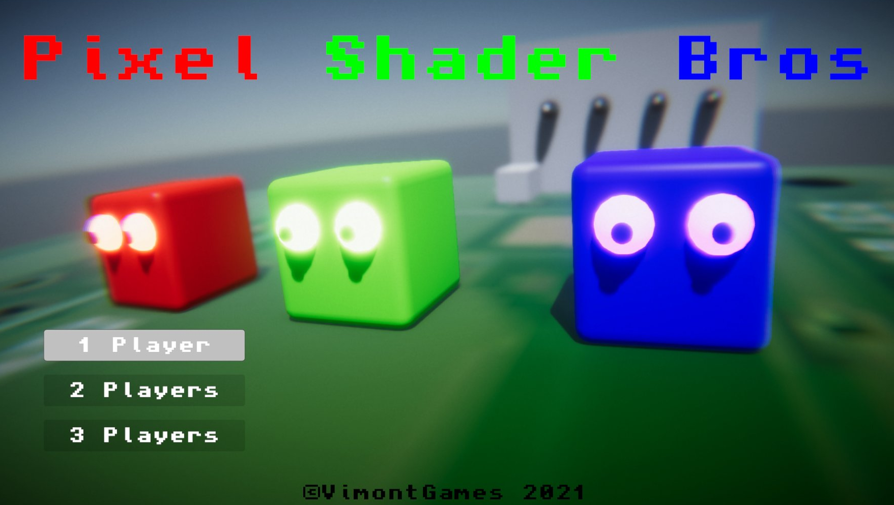

# Pixel Shader Bros
Small simple project just made to discover Unity, but as usual with my kids I had to support local multiplayer from the very beginning ;)

You are playing Red, Green and Blue and you have to escape from an Amiga 600 motherboard.
